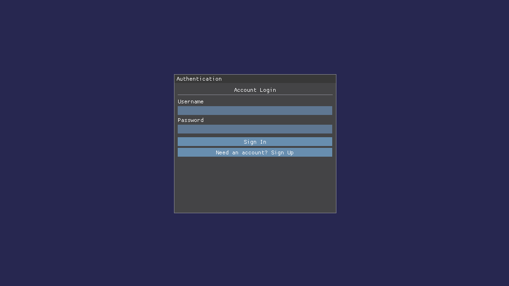
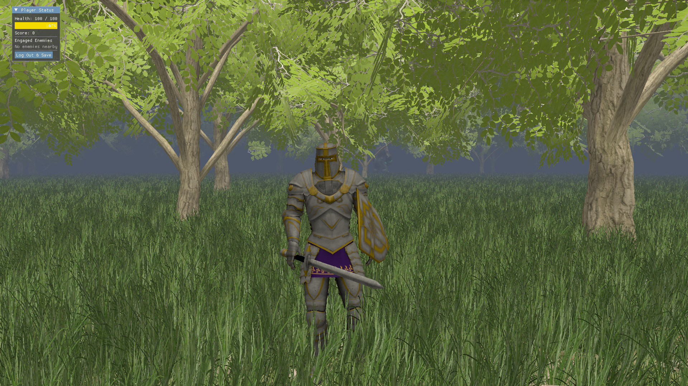

# 🧪 3D Simulation & Interaction Framework

<p align="center">
  <b>A custom real-time 3D simulation and NPC AI interaction framework built with C++17 and OpenGL 3.3 Core.</b>
</p>

<p align="center">
  
</p>

<p align="center">
  
</p>

---

<p align="center">
  
  
  
  
  
  
</p>

---

## 📖 Overview

**3D Simulation & Interaction Framework** is a custom-built real-time 3D graphics and NPC AI engineering project developed in **C++17** with **OpenGL 3.3 Core Profile**.

Rather than being a conventional game project, the application serves as a **graphics and NPC AI engineering testbed** for experimenting with rendering architecture, high-density scene rendering, real-time agent navigation, skeletal animation, networking, and persistent application state.

The framework combines several systems that are commonly found in modern interactive applications:

- A custom **deferred shading pipeline**
- **GPU instanced rendering** for large-scale vegetation
- **Distance-based culling** for high-density scenes
- Hardware-assisted **skeletal animation**
- Grid-based **A* pathfinding**
- Finite-state NPC AI behavior
- **TCP client-server communication** through Winsock2
- Asynchronous state persistence using **MongoDB**
- Dear ImGui authentication and development interfaces

> **Engineering Focus:** Although the project uses game-oriented assets such as characters and trees, its primary purpose is to explore **real-time rendering performance, NPC AI navigation, system integration, and network persistence**.

---

## ✨ Core Features

### 🎨 Deferred Rendering Pipeline

The framework implements a custom deferred rendering architecture based around a **G-buffer**.

The geometry pass stores the information required for subsequent lighting calculations, including:

- World-space positions
- Surface normals
- Albedo / diffuse color
- Specular parameters

A dedicated lighting pass then evaluates the scene using the generated G-buffer data and supports dynamic point lights.

```text
Scene Geometry
      │
      ▼
┌─────────────────┐
│  Geometry Pass  │
└────────┬────────┘
         │
         ▼
      G-Buffer
   ┌─────┼─────┐
   │     │     │
Position Normal Albedo
   │     │     │
   └─────┼─────┘
         ▼
┌─────────────────┐
│  Lighting Pass  │
└────────┬────────┘
         │
         ▼
   Final Lit Image
```

### 🌿 High-Density Instanced Rendering

The project explores GPU instancing for rendering large numbers of repeated objects with substantially fewer CPU-side draw submissions.

The scene supports:

- **1M+ grass blades**
- Instanced forest vegetation
- Distance-based visibility culling
- Large numbers of repeated environmental objects

This provides a practical testbed for investigating the relationship between **scene density, draw-call overhead, GPU workload, and frame rate**.

### 🧍 Skeletal Animation

Characters use a skeletal animation system capable of handling multiple animation states, including:

- Idle
- Running
- Attacking
- Special abilities

Animation data is evaluated at runtime and applied through GPU skinning during rendering.

### 🤖 A* Pathfinding NPC AI

NPC AI agents use grid-based **A\*** navigation to move through environments containing static obstacles.

The system is designed to allow agents to:

- Track player targets
- Navigate around environmental obstacles
- Calculate paths dynamically
- Transition between movement and combat-related states

The implementation also explores **static-memory optimization** to reduce unnecessary runtime allocation during pathfinding.

### 🌐 Client-Server State Persistence

The project includes an asynchronous client-server architecture using **Winsock2 TCP/IP**.

The system connects gameplay state with persistent storage through MongoDB, allowing application data to be saved without blocking the primary rendering loop.

```text
┌────────────────────┐
│   3D Application   │
│  Rendering + Game  │
└─────────┬──────────┘
          │
          │ TCP/IP
          ▼
┌────────────────────┐
│    TCP Server      │
│   Winsock2         │
└─────────┬──────────┘
          │
          ▼
┌────────────────────┐
│      MongoDB       │
│ Persistent State   │
└────────────────────┘
```

### 🔐 Authentication & UI

The project uses **Dear ImGui** for development and application interfaces, including:

- Login
- Registration
- Game/application controls
- Development utilities
- Runtime interaction

---

## 🛠️ Technical Stack

| Component | Technology / Library |
|---|---|
| Language | **C++17** |
| Graphics API | **OpenGL 3.3 Core Profile** |
| OpenGL Loader | **GLAD** |
| Windowing & Input | **GLFW 3.3.8** |
| Mathematics | **GLM** |
| Model Import | **Assimp 5.2.5** |
| UI Framework | **Dear ImGui 1.91.0** |
| Shader Language | **GLSL** |
| Networking | **Winsock2 / TCP-IP** |
| Database | **MongoDB** |
| Database Bridge | **Python** |
| Build System | **CMake 3.15+ / Ninja** |

---

## 📦 Prerequisites

Before building the project, make sure the following tools are available:

- **C++17-compatible compiler**
  - MSVC / Visual Studio 2019+
  - GCC 9+
  - Clang 10+
- **CMake 3.15+**
- **Ninja**
- **Git**
- OpenGL 3.3-compatible graphics hardware and drivers

The project uses CMake `FetchContent` to obtain external dependencies where configured.

---

## 🚀 Building & Running

### Windows

The project currently targets a Windows environment for its Winsock2 networking component.

Configure with Ninja:

```bash
cmake -B build -G Ninja
```

Build:

```bash
ninja -C build
```

Run:

```powershell
.\build\V_Project.exe
```

> **Note:** The first CMake configuration may take longer because external dependencies are downloaded and configured. Later builds should be considerably faster.

---

## 🎮 Controls

| Action | Input |
|---|---|
| Move | `W` `A` `S` `D` |
| Basic Attack | `Left Mouse Button` |
| Skill Ability | `E` |
| Ultimate Ability | `Q` |
| Release Mouse Cursor | `Left Alt` |
| Exit Application | `ESC` |

---

## 🔑 Development Account

For demonstration and development purposes, the application provides a development account:

```text
Username: dev
Password: dev
```

> ⚠️ **Security Notice:** These credentials are intended only for the development/demo environment. Do not reuse them for production authentication or expose real credentials in source control.

---

## 🏗️ Project Architecture

The project is organized around several interacting subsystems:

```text
                    ┌─────────────────────┐
                    │    Application      │
                    │       Loop          │
                    └──────────┬──────────┘
                               │
             ┌─────────────────┼─────────────────┐
             │                 │                 │
             ▼                 ▼                 ▼
      ┌────────────┐    ┌────────────┐    ┌────────────┐
      │ Rendering  │    │ Simulation │    │    Input   │
      │  Pipeline  │    │  & NPC AI  │    │     & UI   │
      └─────┬──────┘    └─────┬──────┘    └────────────┘
            │                 │
            ▼                 ▼
      ┌────────────┐    ┌────────────┐
      │ G-Buffer   │    │ A* / FSM   │
      │ Instancing │    │  Agents    │
      │ Animation  │    │ Navigation │
      └────────────┘    └─────┬──────┘
                              │
                              ▼
                       ┌────────────┐
                       │ Networking │
                       │  & State   │
                       └─────┬──────┘
                             │
                             ▼
                       ┌────────────┐
                       │  MongoDB   │
                       └────────────┘
```

---

## 📁 Project Structure

```text
multi-user-3d-sim/
│
├── assets/              # 3D models, textures, animations
│
├── include/             # Header files
│
├── shaders/             # GLSL vertex and fragment shaders
│
├── src/                 # C++ source files
│
├── lib/                 # External / third-party libraries
│
├── CMakeLists.txt       # CMake build configuration
│
├── LICENSE              # MIT License
│
└── README.md            # Project documentation
```

---

## 🧠 Engineering Highlights

This project was built around several practical graphics-programming and systems-engineering problems.

### Rendering

- Designing a deferred rendering pipeline
- Managing G-buffer attachments
- Implementing dynamic lighting
- Reducing CPU submission overhead through instancing
- Handling very high scene-object counts
- Combining skeletal animation with real-time rendering

### NPC AI & Simulation

- Implementing grid-based A* navigation
- Handling obstacle-aware agent movement
- Designing state-driven agent behavior
- Investigating memory-efficient pathfinding data structures

### Systems & Networking

- Building a TCP client-server communication layer
- Integrating asynchronous state persistence
- Connecting real-time application state with MongoDB
- Separating rendering/game execution from persistence operations

---

## 📊 Performance-Oriented Experiments

A major motivation behind the framework is to investigate how real-time graphics systems behave as scene complexity increases.

Potential areas for benchmarking include:

| Experiment | Metric |
|---|---|
| Increasing grass instance count | FPS / frame time |
| Increasing tree count | CPU & GPU frame time |
| Distance culling enabled/disabled | Visible instances / FPS |
| Deferred vs. forward lighting | Frame time |
| Increasing dynamic light count | Lighting pass cost |
| A* agent count | Pathfinding time |
| Different obstacle densities | Search nodes / pathfinding time |

> These experiments can turn the project from a conventional graphics application into a useful **rendering and simulation research testbed**.

---

## 🔮 Future Improvements

- [ ] More advanced multi-agent behaviors
- [ ] Improved crowd navigation
- [ ] Hierarchical or optimized pathfinding
- [ ] More sophisticated spatial partitioning
- [ ] GPU-based culling experiments
- [ ] Frustum and occlusion culling
- [ ] Additional deferred-lighting optimizations
- [ ] GPU profiling and frame-time analysis
- [ ] Networked multi-user simulation
- [ ] Improved database synchronization
- [ ] Automated performance benchmarking

---

### Supervisor

**Dr. Thandar Soe, Professor**  
Department of Computer Engineering and Information Technology  
Technological University (Mandalay)

## 👥 Project Team

| Name | Role | Primary Contribution |
|---|---|---|
| **Mg Aung Myo Pai** | **Lead Developer & System Integrator** | **Core Engine, Deferred Rendering Pipeline, Instancing, Skeletal Animation, System Integration, Cross-module Debugging** |
| **Ma Khin Yadanar Win** | Developer | Networking & Database Module — TCP Server and MongoDB Integration |
| **Mg Hlwan Moe Aung** | Developer | A* Pathfinding Algorithm Development |
| **Ma Thoon Thiri Swe** | Developer | Finite State Machine (FSM) Logic Design |
| **Mg Nay Phone Myint** | Contributor | Documentation & Testing Support |
| **Mg Kaung Khant Ko Ko** | Contributor | Documentation & Testing Support |

---

## 🎓 Academic Context

**Project:** 3D Simulation & Interaction Framework  
**Project Type:** CEIT Project  
**Focus Areas:** Real-Time Rendering, NPC AI, Simulation & Networking  
**Institution:** Technological University (Mandalay)

---

## 📄 License

This project is licensed under the **MIT License**. See the [`LICENSE`](LICENSE) file for details.

Third-party libraries, models, textures, animations, and other assets remain subject to their respective licenses and original creators' rights.

---

<p align="center">
  <i>Built as a graphics, NPC AI, and systems-engineering project at Technological University (Mandalay).</i>
</p>
